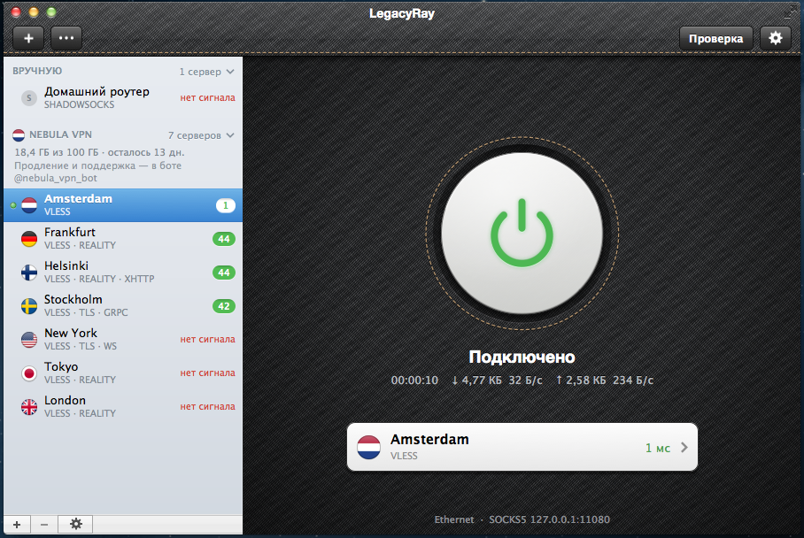
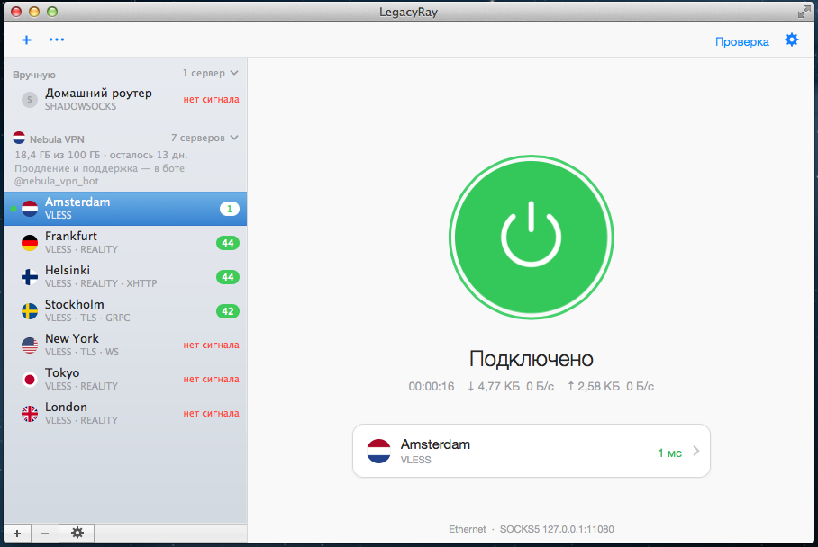
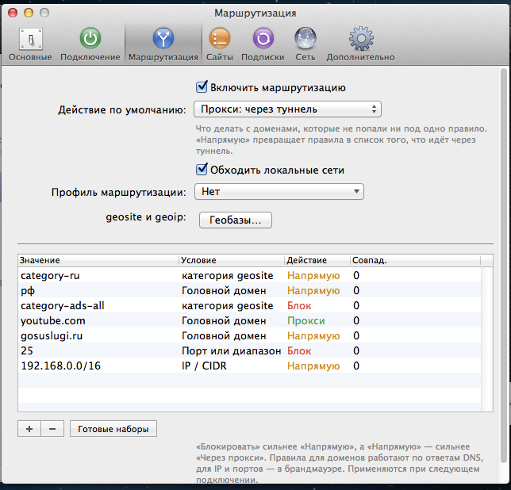
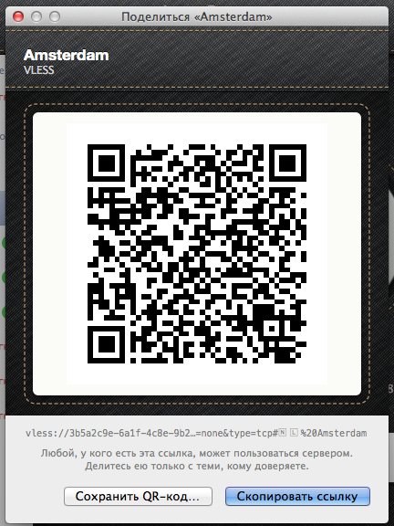

# LegacyRay для Mac

VLESS, Reality, Trojan, Shadowsocks, SOCKS, AmneziaWG и WireGuard для всего
Mac — на **OS X 10.8 Mountain Lion и 10.9 Mavericks** в скевоморфном
оформлении тех лет, **с 10.10 Yosemite** — в плоском. Работает и на более
новых macOS (x86_64; на Mac с Apple Silicon — через Rosetta 2).

Порт [LegacyRay для iPhone](https://github.com/LR-Vensuki/LegacyRay) с тем же
сетевым демоном. Разработчик — **LegacyReborn Project**. LegacyRay — форк
[senko](https://github.com/sqmrak/senko) (sqmrak, GPL‑2.0): сетевое ядро и
демон взяты из senko и доработаны, интерфейс написан заново.



## Скачать

[**LegacyRay‑1.0.1‑mac.zip**](https://github.com/LR-Vensuki/LegacyRay-Mac/releases/latest)
со страницы релизов.

1. Распаковать и перенести LegacyRay в «Программы».
2. Открыть. Программа не подписана сертификатом разработчика, поэтому в первый
   раз — правый щелчок → «Открыть» → «Открыть».
3. LegacyRay попросит пароль администратора, чтобы поставить фоновую службу.
   Это один раз: дальше туннель живёт в системе, даже когда окно закрыто.
4. Добавить сервер: ⌘V со ссылкой или подпиской в буфере обмена, «+» в окне,
   перетаскивание ссылки или файла, или «Распознать QR‑код на экране».

## Что умеет

| | |
|---|---|
| **Протоколы** | VLESS (TCP, TLS, Reality + xtls‑rprx‑vision, WebSocket, XHTTP, gRPC), Trojan, Shadowsocks, SOCKS5/HTTP(S), AmneziaWG 1.0/1.5/2.0 и WireGuard |
| **Подписки** | URI‑списки, base64, happ‑ссылки (включая crypt5), Xray/sing‑box JSON, Clash YAML, Shadowrocket/Surge INI; трафик, срок, дата сброса, объявление и поддержка провайдера прямо в списке; напоминания об окончании в Центре уведомлений; User‑Agent, HWID |
| **Весь трафик Mac** | через pf: правила в собственном якоре `com.apple/legacyray` рядом с системными, основной набор правил не трогается, pf включается по токену, как это делают службы Apple; DNS тоже идёт в туннель |
| **Маршрутизация** | правила по доменам, `geosite:`/`geoip:`, IP и портам; профили маршрутизации Happ (`happ://routing/…`); раздельное туннелирование по сайтам («всё, кроме списка» / «только список») с импортом списков Amnezia |
| **Безопасность** | kill switch (UDP кроме DNS не уходит мимо туннеля), свой DNS‑сервер, «Инкогнито» для скриншотов |
| **Обход блокировок** | фрагментация TLS‑рукопожатия, ChaCha20 первым |
| **Без брандмауэра** | локальный SOCKS5 `127.0.0.1:11080` для программ, которые умеют прокси; по желанию — для всей локальной сети |
| **Строка меню** | значок‑«нашивка» с состоянием, меню с серверами по подпискам, флагами и задержкой |
| **Импорт** | ⌘V, перетаскивание, ссылки `vless://` `trojan://` `ss://` `happ://` `legacyray://` из любых программ, файлы (`.lray`, `.conf`, `.vpn`, Karing `.zip`), QR‑код с экрана или из картинки |
| **Свои серверы** | установка Xray Reality и AmneziaWG на VPS по SSH с живым журналом; клиенты, QR, перезапуск, удаление |
| **Инструменты** | проверка качества соединения с детектором утечки, диагностика (состояние демона, журнал, правила pf), резервная копия `.lray` (совместима с iPhone), проверка обновлений через GitHub |

Языки: русский, английский, китайский.

## Оформление

| Тема | Что это |
|---|---|
| **Классическая** (10.8–10.9) | чёрный деним иконки с медной строчкой поднимается в заголовок окна — как кожа у «Календаря» 10.8; клавиши панели — тёмное стекло в утопленной оправе; справа — деним с «жемчужной» кнопкой в прошитом гнезде (значок серый в покое, янтарный при подключении, зелёный, когда туннель поднят); слева — родной source list 10.8 с флагами‑«пуговками» и значками задержки, как у «Почты»; HUD‑уведомления; глянцевые значки настроек |
| **Плоская** (10.10+) | окно под прозрачным заголовком, полупрозрачные (vibrancy) боковая панель и шапка, кольцо вместо «жемчуга», тонкий системный шрифт, синие глифы |
| **Автоматически** | классическая на 10.8–10.9, плоская с Yosemite; вручную — Настройки → Основные |



<p>


</p>

Всё, кроме тайла денима, нарисовано кодом (CoreGraphics), чётко на обычных и
Retina‑экранах. Скриншоты — из настоящей OS X 10.8.5.

## Как устроено

```
LegacyRay.app ──(сокет /var/tmp/legacyrayd.sock)──▶ legacyrayd (root, launchd)
      │                                                  ├─ pf: якорь com.apple/legacyray, lo0
      └─ legacyray-kick (setuid) ──▶ legacyrayawgd      └─ SOCKS5 127.0.0.1:11080
                                     (AmneziaWG, utun)
```

При первом запуске программа ставит службу через окно авторизации (так
делали программы до SMJobBless):

| Путь | Что |
|---|---|
| `/usr/local/legacyray/bin` | `legacyrayd`, `legacyrayctl`, `legacyray-kick` (setuid; отвечает только root и владельцу папки данных), `legacyrayawgd`, `legacyray-ssh` |
| `/usr/local/legacyray/lib/cacert.pem` | корневые сертификаты Mozilla для TLS демона (подписки, обновления) |
| `/Library/LaunchDaemons/com.legacyray.daemon.plist` | демон launchd |
| `/Library/Application Support/LegacyRay/legacyray.cfg` | серверы, подписки, правила, настройки демона (root, 0600) |
| `/Library/Application Support/LegacyRay/Data` | то, что делят программа и демон: профили AWG, геобазы, свои серверы (владелец — установивший пользователь, 0700) |
| `/var/log/legacyray-system.log` | журнал демона (виден в «Консоли») |
| `/usr/local/bin/legacyrayctl` | управление из Терминала |

Новая версия программы сама предложит обновить службу. Удаление — Настройки →
Дополнительно → «Удалить…» (с настройками или без).

## Сборка (на Linux)

Нужны [Theos](https://theos.dev) в `~/theos` (его тулчейн clang/ld64),
`curl`, `perl`, `make`, `python3` (+ Pillow для иконки) и OS X 10.8 SDK из
Xcode 4.6.3. SDK достаётся из образа Xcode без Mac:

```bash
7z x Xcode_4.6.3.dmg 'Xcode/Xcode.app/Contents/Developer/Platforms/MacOSX.platform/Developer/SDKs/MacOSX10.8.sdk/*'
mv Xcode/Xcode.app/Contents/Developer/Platforms/MacOSX.platform/Developer/SDKs/MacOSX10.8.sdk ~/theos/sdks/
```

7z распаковывает часть символических ссылок SDK пустыми файлами; для сборки
важна `usr/lib/libiconv.dylib` — она должна указывать на `libiconv.2.4.0.dylib`.

```bash
make deps          # один раз: исходники OpenSSL 3.5 и libssh2
make deps-mac      # один раз: они же под x86_64 / OS X 10.8
make mac           # → mac/build/LegacyRay.app (демон и помощники внутри)
make mac-zip       # → packages/LegacyRay-<версия>-mac.zip
make test          # хост‑тесты демона (нужен make deps HOST=1)
```

Всё линкуется с SDK 10.8 и `-mmacosx-version-min=10.8`, поэтому функции новее
10.8 в бинарники не попадут; то, что появилось в Yosemite (vibrancy,
полноразмерные окна, веса системного шрифта), ищется во время работы.
Подробности об устройстве кода — в [mac/README.md](mac/README.md).

## Проверено

В OS X 10.8.5 (QEMU/KVM): главное окно в обеих темах, все вкладки настроек и
все окна, строка меню, импорт, подписки, пинги, состояния подключения и
ошибки. Демон из бандла подключается по VLESS и пропускает трафик через свой
SOCKS‑порт; TLS демона (OpenSSL 3.5, TLS 1.3) с проверкой сертификатов
работает на 10.8. Правила pf, которые генерирует демон, без ошибок разбирает
системный `pfctl` 10.8 во всех вариантах, которые демон пробует.

**Пока не проверено на живой системе:** режим «весь трафик через pf» с
правами root, AmneziaWG на `utun`, установка службы через окно авторизации,
Mavericks и Yosemite+ (плоская тема проверялась на 10.8 принудительно, без
vibrancy). Если что‑то не работает — Справка → Диагностика → «Сохранить
отчёт…» (ссылки, ключи и адреса в отчёте заменены) и issue в этом
репозитории.

## Ограничения

Hysteria2, OpenVPN, IKEv2 и Cloak не поддерживаются; трафик IPv6 при поднятом
туннеле блокируется; правила применяются по приоритету Block > Direct > Proxy,
а не по порядку; geosite берётся из компактного `dlc.dat`, категории
`regexp:` пропускаются. Распознавание QR‑кода с экрана на macOS 10.15+
требует разрешения «Запись экрана».

## Структура

```
mac/            программа для OS X (AppKit, MRC), см. mac/README.md
app/Sources/Core  общее ядро с версией для iPhone: клиент демона, туннель, каталог,
                  профили AWG и маршрутизации, SSH-серверы, QR-кодер, локализация
daemon/         legacyrayd и помощники (C): Makefile.mac — OS X, Makefile.ios — iOS
common/         пути, о которых договариваются демон и программа (senko_paths.h)
tests/          хост-тесты
scripts/        зависимости (build_deps_mac.sh), иконка (mac_icon.py), локализация
app/, tweaks/, layout/  версия для iPhone — docs/README-ios.md
```

## Лицензия

GPL‑2.0 (как у senko), см. `LICENSE`. Сторонние компоненты — в
`app/Resources/THIRD_PARTY_LICENSES.txt`: OpenSSL, libssh2 (BSD‑3), ZBar
(LGPL‑2.1), cJSON (MIT), корневые сертификаты Mozilla (MPL 2.0). Геоданные
(v2fly domain-list-community, ipverse) не входят в пакет — скачиваются по
запросу.
